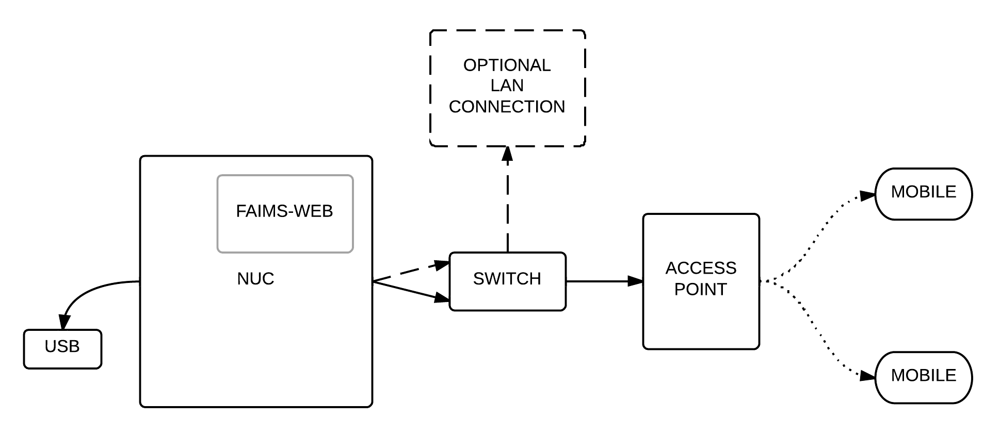

Hardware Documentation
===================================================================

USB drive attached to the NUC is intended for backups and recovery.

The NUC provides the basis of the system and access to the FAIMS-web
application through LinuX containers, running Ubuntu 14.04.  

The switch provides upstream LAN connection, and a point of connection
to the access point. Without the switch, the network is WIFI only. The
access point can be directly connected to the NUC, though this would
limit any additional connections to the network.

The optional LAN connection is intended for possible local office use.
This connection operates on a separate network to the access point for
mobile devices. 

The access point provides connection for mobile devices to the network.

 

 

 

 

 

-   [3014719\_attachments\_FAIMS Hardware Diagram - New
    Page.png](attachments3014719_attachments_FAIMS%20Hardware%20Diagram%20-%20New%20Page.png)
