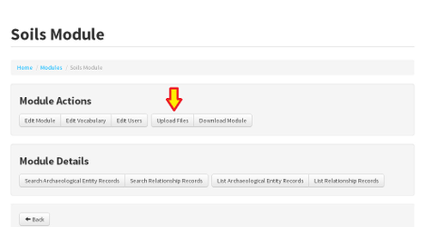
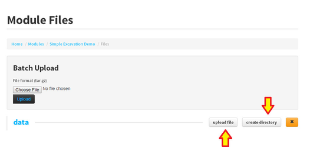

Import GeoTiffs into FAIMS App via ArcGIS
======================================================================================

*For ArcGIS 10.1 users, here are the instructions on how to prepare
GeoTiffs for use in the FAIMS app using the ArcGIS tools.*

Step-by-step guide 
------------------

The preparation of rasters in ArcGIS for FAIMS deployment comprises
three basic steps: reprojection, tiling, transfer. The second is
optional, depending on your raster size. This procedure has been tested
in ArcGIS 10.1 SP1, and we welcome any feedback on other versions of the
software.

1.  Make sure your file is a GeoTiff format

2.  Reproject the file to EPSG 3857

3.  Tile the image. This step is optional and applies especially to
    large files (100Mb and higher), or if for some reason your raster is
    not displaying fast enough on your device (low power processor).

4.  Upload the tile(s) (GeoTiffs) onto the FAIMS Server using this
    route:

    1.  Open the web browser with your FAIMS server and login

    2.  Navigate to your \"Module Actions\" \> click \"Upload Files\"\
                

    3.  Use the existing \"Data\" directory or create additional
        sub-directories using the \"create directory\"  button\
                
    4.  Upload individual files using the \"upload file\" button next to
        \"create directory\".
    5.  If you have multiple files, you can use the black  \"Upload\"
        button after you zip **all** your files up using 7zip. The
        zipped files needs to have a .tar.gz extension for the batch
        upload to work.

5.  Propagate the newly added files to all your devices by connecting
    your devices to the Server, clicking on the Module and selecting
    \"Download\" 

6.  There is a substitute way of uploading rasters onto the device via
    USB cable from your desktop, without putting them up on Server
    first. This route is explained in the note below. It is
    **disrecommended** for multiple reasons and may cause problems with
    your raster rendering, please use it as the last resort.\
    \
    \

::: 
[ ]

::: 
*Note that you can also transfer the ArcGIS raster files from your
desktop onto the USB-connected device *via a File Explorer. You need to*
navigate to the appropriate FAIMS Module folder on your Device (Internal
memory \> Emulated \> 0 \> FAIMS \> Modules \> Module UUID; UUIDs can be
tricky to identify with a particular module if you have multiple modules
loaded, as it is not a human-readable name!). Inside the module folder
you navigate to Files\>Data folder. You can create Maps folder inside or
simply deposit the rasters in the Data folder. Make sure all have
transferred. Back on the device, open the module, navigate to Map
screen, click on Layers \> Add Raster file \> navigate to the folder
where you deposited the files \> click one of the files and watch it
render. Again, this is a **disrecommended** option. Use it as the last
resort, if you use one and only one device in the field, or if your
network connection fails fatally.*
:::
:::

Related articles 
----------------

-   

    [Page:]

    

    ::: 
    [Install and Run the FAIMS
    Server](../FAIMS/Install+and+Run+the+FAIMS+Server.html)
    :::

-   

    [Page:]

    

    ::: 
    [Create a Module on the
    Server](../FAIMS/Create+a+Module+on+the+Server.html)
    :::

-   

    [Page:]

    

    ::: 
    [Import GeoTiffs into FAIMS App via
    ArcGIS](../FAIMS/Import+GeoTiffs+into+FAIMS+App+via+ArcGIS.html)
    :::

-   

    [Page:]

    

    ::: 
    [Testing Methodology](../FAIMS/Testing+Methodology.html)
    :::

-   [3014710\_attachments\_FilesArrow.png](attachments/3014710_attachments_FilesArrow.png)
-   [3014710\_attachments\_UploadFilesArrow.png](attachments/3014710_attachments_UploadFilesArrow.png)
-   [3014710\_attachments\_Files.png](attachments/3014710_attachments_Files.png)
-   [3014710\_attachments\_UploadFiles.png](attachments/3014710_attachments_UploadFiles.png)
