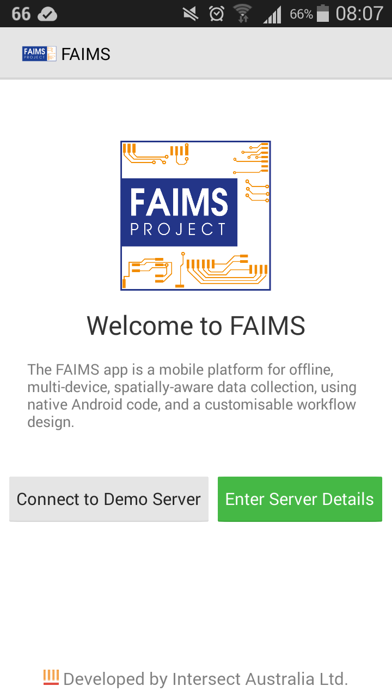
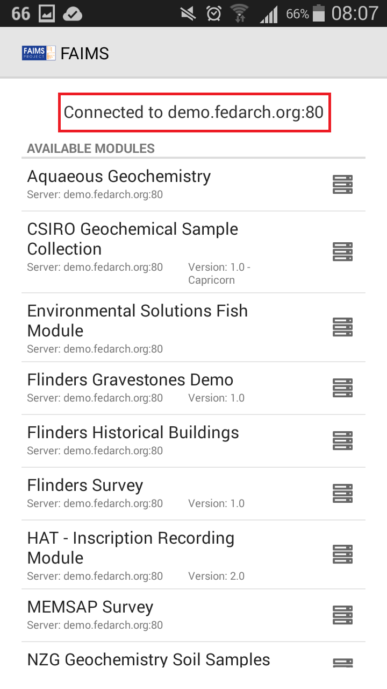
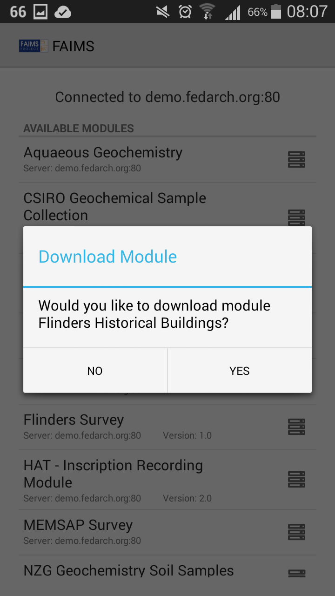
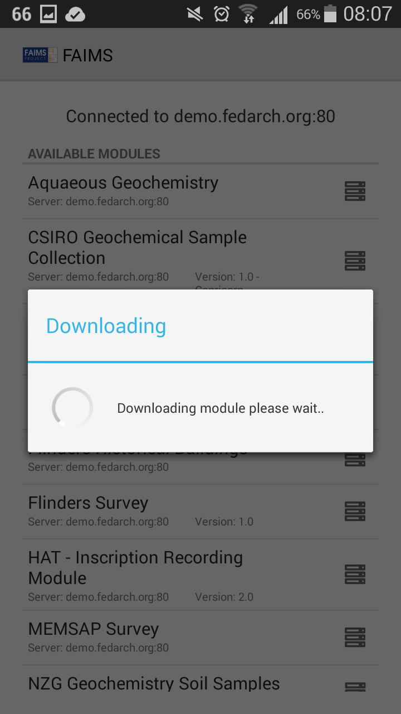
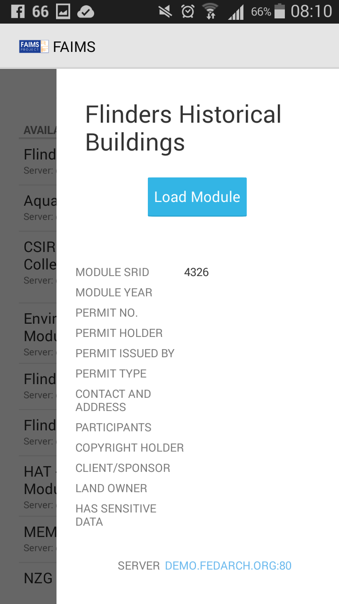
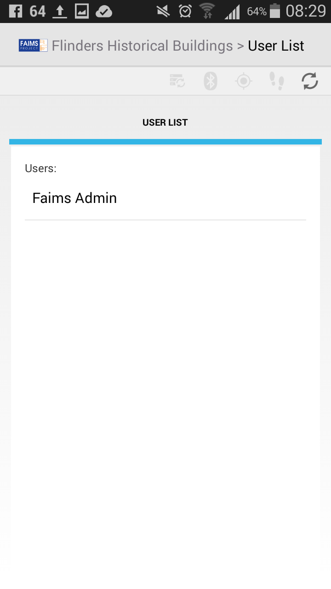
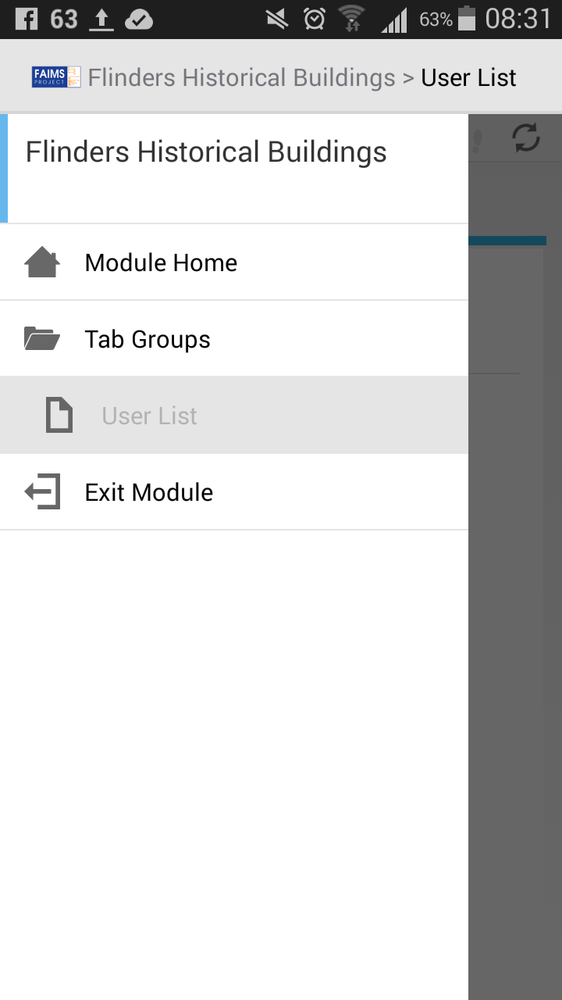
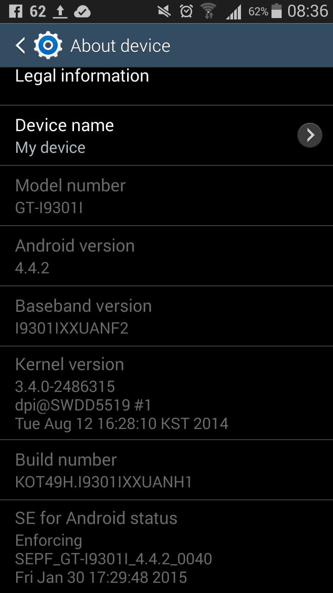
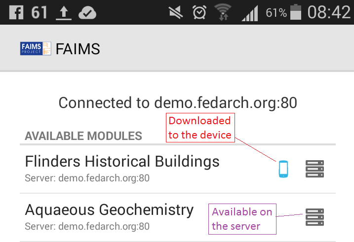

# FAIMS 101 - Getting Started

The best way to get started with FAIMS Mobile is to look at some of the
digital recording modules we have developed and posted in our online
Module Library. Here is what you need to look at them:

### Prerequisites:

-   An device running Android 6.x or higher (any device >2Gb of RAM,
    > and from a major manufacturer will likely work)

-   Access to stable and high-bandwidth wifi for the app download[^1].

-   5 minutes time

Step-by-Step
============

1.  Get your hands on a device running Android 5.x (or higher version)
    > device (if you are thinking of buying one for your fieldwork,
    > check out our [[list of
    > recommendations]{.underline}](https://www.fedarch.org/news/2016Devices/))

2.  Install the FAIMS app using one of the following two methods:

    a.  Switch on the wifi, get the device online and download the FAIMS
        > app from Google Play Store (show a picture of the icon they
        > are looking for on the tablet)

    b.  Connect your Android device to your computer and install the
        > FAIMS app from Google Play by visiting the [[FAIMS page on the
        > Google Play
        > Store]{.underline}](https://play.google.com/store/apps/details?id=au.org.intersect.faims.android&hl=en)
        > 

3.  Once the app is installed, open it and you should see the following
    > screen:

4.  For now, to try FAIMS before setting up your own data server, select
    > "Connect to Demo Server" button on the bottom left.

5.  You should now see a screen telling you that you are connected to
    > "demo.fedarch.org" This screen will also show you a scrolling list
    > of the available modules. Modules are the way that FAIMS can be
    > customised to support your unique research workflows. They are
    > your Digital Recording Forms tailored specifically to your
    > project.

6.  Which module should I select? That depends on your research needs.
    > Do you need GIS, hierarchical dropdowns or data input validation?
    > Here are a few hints about features of some of the demo modules:

    c.  CSIRO Geochemical Sample collection: has GIS (map viewing and
        > shape creation), validation, dynamically generated UI items,
        > autoincrementing IDs, and data input validation. Has Oz raster
        > data (give it 60s to open the module)

    d.  Flinders Historical Buildings: has hierarchical dropdowns and
        > lots of picture dictionaries for various architectural
        > elements in Oz historic architecture, logic generates date
        > ranges on basis of image selections.

    e.  MEMSAP Survey: designed for transect survey with stone artefact
        > recording; GPS is required. Has fine GPS and Tracklog
        > settings, Map and captured points viewing, Survey Unit ID
        > validation, etc.

7.  Click the module to Download it.

    f.  If you touch your device's screen during the module download,
        > the process will stop and you have to resume.

    g.  If your internet connection goes off during the module download,
        > you have to start over.

    h.  If you are asked 'Do you want to download or update the
        > module?', then the Module is already on your device.

> 
> 

8.  Once the Module has downloaded, you will see the Informational panel
    > with Module available info. Select the button "Load Module" and
    > the Module will start loading.
    > 
    > 

9.  After logging in you can start entering data in your module.

10. Once you are in a module, notice the top bar with three dots on the
    > right - that is where some options are hiding. (enable sync,
    > connect GPS, etc.) Below there is a bar with indicator icons,
    > indicating the status of your GPS, syncing, server connectivity,
    > etc. Once you start entering data and navigating deeper into the
    > module, use the Back button to navigate up in the hierarchy. If
    > you swipe your finger from the left edge of the screen to the
    > right you will also navigate up the module hierarchy, exit the
    > module and use the buttons to create new record, duplicate or
    > delete a record.

User Guidelines
---------------

For Guidelines on how to use the Mobile Platform (create, edit, modify
and administer the modules as well as the server), please refer to our
[[online User
Guide.]{.underline}](https://faimsproject.atlassian.net/wiki/display/MobileUser/Home)
Alternative path to these manuals exists via the Support tab on our
website [[www.fedarch.org]{.underline}](http://www.fedarch.org/) or by
using the Getting Started button on the Mobile Platform subsections
located throughout.

Troubleshooting
---------------

### Cannot download the FAIMS app: Did you get a message saying "Your device isn't compatible with this version" when trying to download the FAIMS app?

Your device's hardware or software may not be supported.

*Hardware check*: Does your device have a rear camera? Some hardware is
essential for the device to be compatible for download via Play Store.
If you don't have a rear camera, don't worry. Your device will run the
app, but it will need to be installed manually (via apk. see Guidelines
below).

*Software check:* Is your device running Android 4.3 - 5.0.1? Check the
make of device and your Android kernel by going to Settings > About
Phone ( the label may differ by device) and copy the Android version to
us at [[support@fedarch.org]{.underline}](mailto:support@fedarch.org).
The info should look like this: Model number (e.g.Nexus 7), Android
version (e.g. 4.4), Kernel version (e.g. 3.1.10-gee1aob2). Feel free to
send a screenshot if that's easier (most phones can take a screenshot
by holding down volume down and power keys or Home button and power
keys).

### Cannot see any modules in the list

Check that you are connected to demo.fedarch.org ( the line should
appear above the module list). Exit the app by swiping it away in your
list of applications. Check that you have good wifi connection, open the
app and try again. If problems (wifi is sporadic) persist, try again
when you have reliable wifi. If problems persist with good wifi, shoot
an email to
[[support@fedarch.org]{.underline}](mailto:support@fedarch.org) The
Demo server is hosted on Australian national infrastructure, which is
subject to downtimes for maintenance, which can take 24 hrs or more. If
the Demo server is being maintained we will send you information to
reroute to an active server.

**Cannot see any modules in the list when offline**

You need to be online to see and download recording modules. Once
downloaded, they will show on your device even when offline. The
downloaded modules have a blue mobile device icon on the right hand
side. Modules that have not been downloaded have a server icon only.

### Alternate ways of installing FAIMS (not via Google Play) 

When Google Play installation does not work for you you can download the
installation file (faims-android.apk with the most recent date) from our
website: http://fedarch.org/apk

If you do install manually, the app cannot download new updates, and may
suffer from already-fixed bugs. Please check with us if running into any
issues.

Before you can install FAIMS apk on your device you will need to go into
the Android Settings on your device and select Security. Then make sure
"Unknown sources" is ticked.

If you download directly onto your Android device you may see a warning
that "This type of file can harm your device". This is a precaution
against accidental malware installation. Don't worry -
faims-android.apk will not harm your device! Tap OK and
faims-android.apk will download. Then click on the file in your file
manager and install FAIMS. As the last step disable install from
"Unknown sources" reversing the procedure above.

What else can FAIMS app do?
---------------------------

Much more! The sample recording modules illustrate some of the Mobile
Platform functionality. The App can actually do much more, though, so if
you have specific needs and requirements, please contact us.

To learn more about FAIMS project in general, please see [[Australian
Archaeology 2013 (77)
article]{.underline}](http://search.informit.com.au/documentSummary;dn=721992925861948;res=IELHSS)*,*
titled *Creating eResearch tools for archaeologists: The federated
archaeological information management systems project.*

Contact 
--------

Thank you for trialling FAIMS Mobile Platform! Email us at
[[enquiries@fedarch.org]{.underline}](mailto:enquiries@fedarch.org) if
you have any questions

[^1]: Check that your wifi is not coming through a proxy. Also if you
    want to try a module with raster data in it ( [see our
    list](https://docs.google.com/a/fedarch.org/spreadsheets/d/13fvm_syQD-QEQIJTEUqSkQoWeZyFjbkfIlG5AjhzRxA/edit#gid=1324979025)),
    beware that downloads can be larger than 200Mb and therefore take
    10-15 mins depending on your wifi download speed. Do not interact
    with the device while the download is in progress. **Tapping the
    screen cancels the download.**
